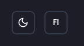
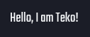
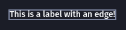

# SY Template

This template provides a setup for SY projects in [Vite](https://vite.dev/) with [React](https://react.dev/), [Typescript](https://www.typescriptlang.org/), [TailwindCSS](https://tailwindcss.com/) and custom components (mostly based on [shadcn](https://ui.shadcn.com/)).

## Installation

Clone the repository:

```sh
git clone https://github.com/syvkst/sy-template.git
```

Open the directory and edit `App.tsx`.

## Theme and language

This template contains components for changing the theme and language of the application. Supported languages are Finnish and Swedish. Localization is based on [i18next](https://www.i18next.com/).

Internal components use `src/loc/components.json` for translations (with namespace `components`). The default translation namespace is `strings`, so you may add your own translations to `src/loc/strings.json` and immediately start utilising them without any namespace prefixes. For usage in components, refer to react-i18next [useTranslation](https://react.i18next.com/latest/usetranslation-hook) hook documentation.

Theme mode and language toggles are simple button-based components without props:

```tsx
import { ModeToggle } from "@/components/ui/mode-toggle";
import { LanguageToggle } from "@/components/ui/language-toggle";

<ModeToggle />
<LanguageToggle />
```



You may get (and also set) the user's language choice with the `useLanguage` hook:

```tsx
import { useLanguage } from "@/hooks/useLanguage";

export function MyComponent() {
  const [language, setLanguage] = useLanguage();

  if (language === "sv") {
    return "Hej!";
  } else {
    return "Terve!";
  }
}
```

The `useLanguage` hook will return either `"fi"` or `"sv"`. If `setLanguage` is used with any other string, the language will be set to `fi`.

## Fonts and colors

Default font for all elements is `Fira Sans`, and `Dosis` for headings. Both font files are included as assets. Other included fonts are:

- `Miniver`
- `Teko`; and
- `Silkscreen`

Corresponding Tailwind classes of `-firasans`, `-dosis`, `-miniver`, `-teko` and `-silkscreen` may be utilised for these fonts:

```tsx
<span className="font-teko">Terve maailma!</span>
```



All fonts are licensed with [SIL OPEN FONT LICENSE Version 1.1](https://openfontlicense.org). License files and copyright notices are stored in `src/fonts/[FONT-NAME]` directory for each font, respectively.

This template includes a palette of slategray-ish colors, mostly for backgrounds, text, borders and layering. These are named `sy-base-01` through `sy-base-13` and may be accessed with TailwindCSS classes in a similar manner to fonts:

```tsx
<Label className="border border-sy-06">This is a label with an edge!</Label>
```


